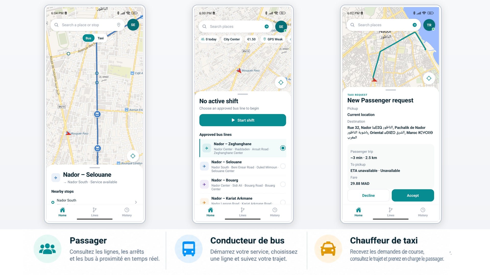
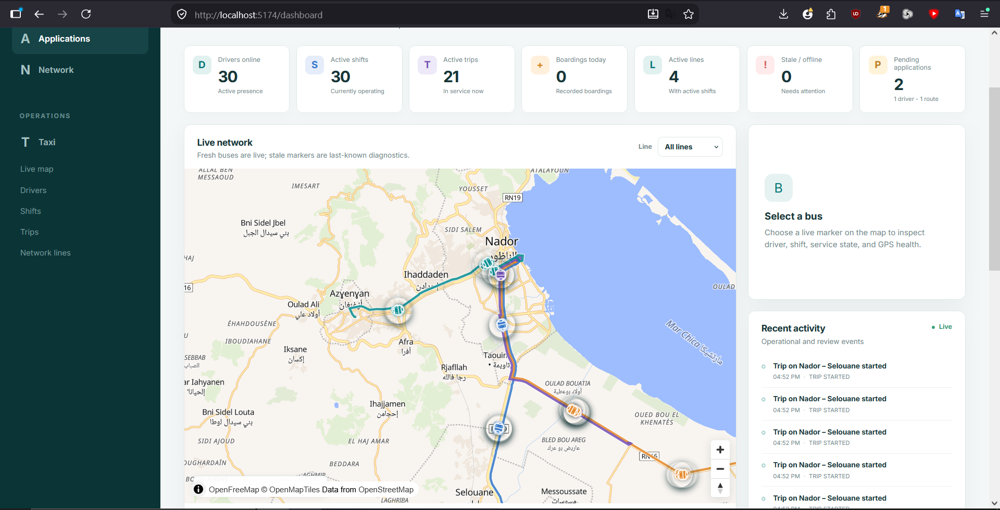
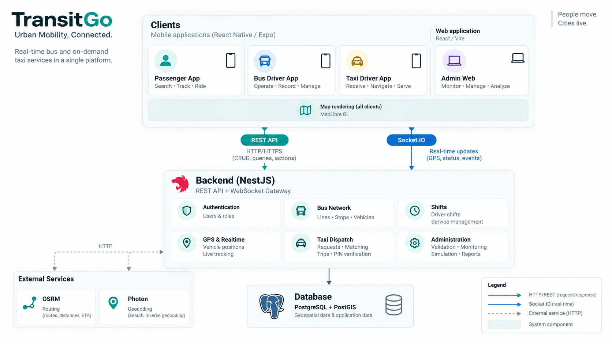
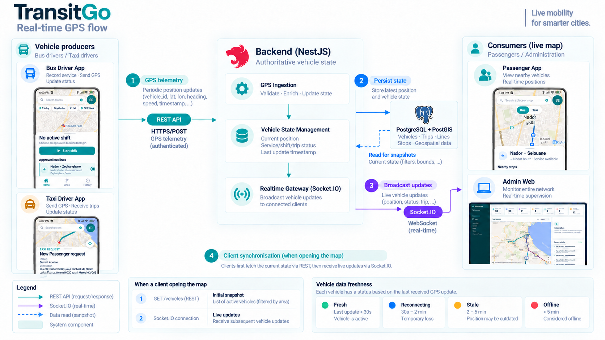
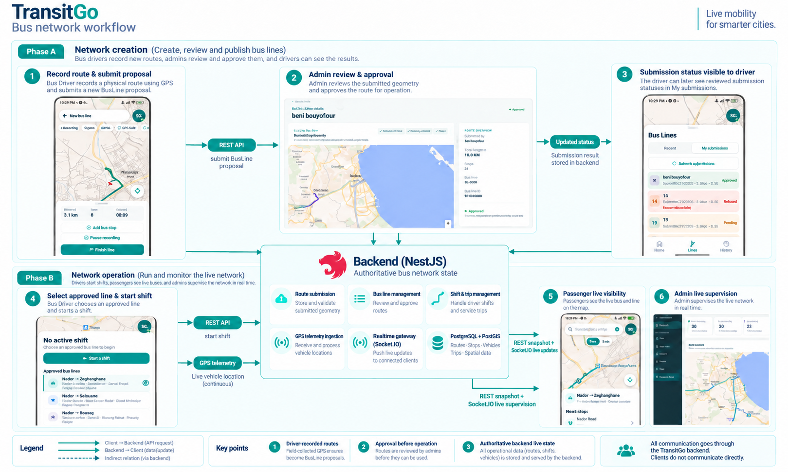
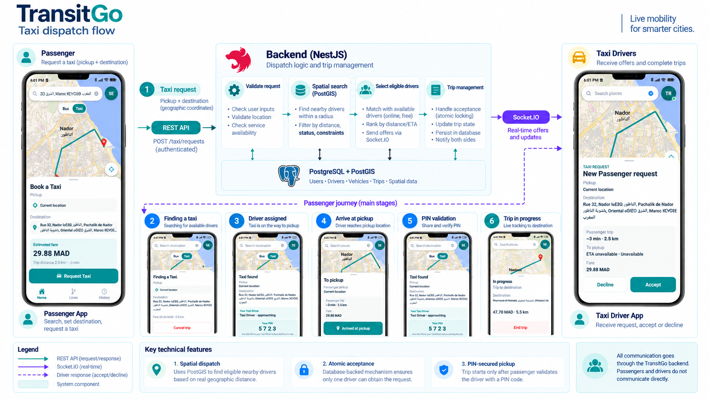
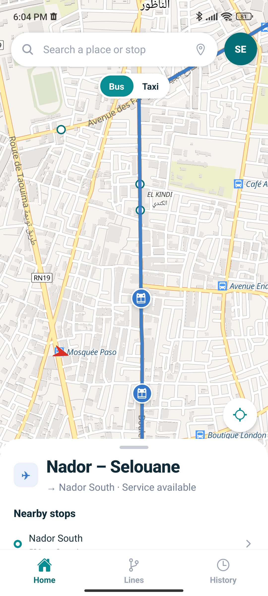

# TransitGo

### Plateforme de mobilité urbaine en temps réel

TransitGo est une plateforme de mobilité qui réunit le transport collectif par bus et le transport à la demande par taxi au sein d'un même système.

Elle permet le suivi des véhicules en temps réel, la gestion du réseau de bus, l'enregistrement de nouvelles lignes et la mise en relation entre passagers et chauffeurs de taxi.

> Ce dépôt présente TransitGo sous la forme d'une étude de cas technique. Le code source de la plateforme est maintenu privé.

---

## Les acteurs de la plateforme

TransitGo propose une expérience adaptée aux différents acteurs du réseau : passagers, conducteurs de bus et chauffeurs de taxi.

  

### Supervision et administration

Le tableau de bord centralise la supervision opérationnelle de TransitGo : véhicules connectés, services actifs, trajets en cours, lignes du réseau et état des données GPS.

Les administrateurs disposent d'une vue cartographique en temps réel permettant de suivre l'activité du réseau et d'inspecter les véhicules en service.

  

---

## Fonctionnalités principales

TransitGo couvre deux modes de mobilité au sein d'une même plateforme : le transport collectif par bus et le transport à la demande par taxi.

### Réseau de bus

- Suivi en temps réel des bus et de leur position sur le réseau.
- Consultation des lignes, des arrêts et des véhicules à proximité.
- Gestion des services et des lignes par les conducteurs.
- Enregistrement GPS de nouvelles lignes de bus.
- Soumission et validation des nouvelles lignes par l'administration.
- Supervision de l'activité du réseau et de l'état des véhicules.

### Transport à la demande

- Création d'une demande de taxi à partir d'un point de départ et d'une destination.
- Recherche géographique des chauffeurs disponibles à proximité.
- Envoi des demandes de course aux chauffeurs concernés.
- Attribution atomique d'une course afin d'éviter les doubles affectations.
- Suivi en temps réel de l'approche du chauffeur.
- Validation de la prise en charge du passager par code PIN.
- Suivi du trajet jusqu'à sa finalisation.

### Temps réel et supervision

- Transmission des positions GPS des véhicules au backend.
- Diffusion des mises à jour en temps réel via Socket.IO.
- Synchronisation entre les applications mobiles et l'interface d'administration.
- Gestion de la fraîcheur des positions et des états de reconnexion.
- Supervision des véhicules et de l'activité opérationnelle.
- Simulation de plusieurs bus et taxis pour tester les scénarios multi-véhicules.

---

## Architecture du système

TransitGo repose sur une architecture centralisée dans laquelle le backend constitue la source de vérité pour l'état opérationnel de la plateforme.

Les applications mobiles partagent une même base React Native / Expo et adaptent leur interface et leurs fonctionnalités au rôle de l'utilisateur. L'administration dispose d'une application web dédiée.

  

### Principes d'architecture

- **Backend centralisé — NestJS :** gère l'authentification, le réseau de bus, les services, les trajets, le dispatch des taxis et l'état des véhicules.
- **REST API :** utilisée pour les opérations métier, les requêtes et la transmission des données vers le backend.
- **Socket.IO :** diffuse les changements d'état en temps réel vers les clients connectés.
- **PostgreSQL + PostGIS :** stocke les données métier et fournit les capacités géospatiales nécessaires au dispatch et aux traitements liés aux positions.
- **MapLibre :** assure le rendu cartographique dans les interfaces clientes.
- **OSRM :** fournit le calcul d'itinéraires, de distances et de trajets.
- **Photon :** fournit la recherche d'adresses et le géocodage.

### Synchronisation en temps réel

Le suivi des véhicules repose sur une séparation entre l'ingestion des positions GPS, la gestion de l'état côté serveur et leur diffusion aux clients.

  

Les conducteurs transmettent périodiquement leur position GPS au backend via l'API REST. Le backend valide ces données, met à jour l'état de référence du véhicule et persiste les informations nécessaires dans PostgreSQL/PostGIS.

Lorsqu'un passager ou un administrateur ouvre la carte, l'état initial est récupéré via REST. Les mises à jour suivantes sont ensuite diffusées en temps réel par la gateway Socket.IO.

Cette approche permet notamment de gérer la fraîcheur des positions et de distinguer les véhicules actifs de ceux dont les données deviennent temporairement obsolètes ou indisponibles.

---

## Cycle de vie du réseau Bus

TransitGo ne se limite pas à afficher des bus sur une carte. Le réseau lui-même peut être créé à partir d’un trajet réellement parcouru par un conducteur, puis validé avant d’être utilisé en exploitation.

  

Le diagramme ci-dessus présente les deux grandes phases du fonctionnement du réseau Bus : **la création d’une ligne** puis **son exploitation en temps réel**.

### Création et validation d'une BusLine

Pendant l’enregistrement, l’application construit progressivement la géométrie du trajet à partir des positions GPS et des arrêts ajoutés. Une fois l’enregistrement terminé, cette proposition est envoyée au backend.

Une fois le parcours terminé, le conducteur soumet la proposition au backend. Celui-ci enregistre la BusLine proposée et son état afin qu’elle puisse être examinée depuis l’interface d’administration.

L’Admin consulte ensuite le tracé soumis et les informations associées avant de l’accepter ou de le refuser. Le résultat de cette revue est conservé côté backend et devient visible dans l’espace **My submissions** du conducteur.

Cette étape permet de distinguer les parcours simplement proposés des lignes réellement autorisées pour l’exploitation.

### Mise en exploitation d'une ligne approuvée

Une ligne approuvée devient disponible dans l’espace du Bus Driver. Le conducteur peut alors la sélectionner et démarrer un **Shift**.

À partir de ce moment, l’application conducteur transmet régulièrement la position GPS du véhicule au backend. Le backend reste la source de vérité pour l’état du Shift, du véhicule et de la ligne actuellement exploitée.

Les applications clientes ne communiquent pas directement entre elles : les changements d’état et les positions passent systématiquement par le backend TransitGo.

### Visibilité en temps réel

Le Passenger récupère d’abord l’état courant du réseau depuis le backend, puis reçoit les nouvelles positions des véhicules en temps réel. Il peut ainsi visualiser les bus actifs sur leur ligne ainsi que les informations associées au réseau.

L’Admin utilise le même état centralisé pour superviser les véhicules, les lignes actives, les Shifts et la fraîcheur des positions depuis son interface web.

TransitGo combine ainsi un état initial récupéré via REST avec des mises à jour temps réel diffusées via Socket.IO.

### Points techniques clés

- **Enregistrement GPS des lignes** — création d’une géométrie de BusLine à partir du trajet réellement parcouru par le conducteur.
- **Workflow d’approbation** — une ligne soumise doit être examinée avant de pouvoir être utilisée en exploitation.
- **État centralisé** — les BusLines, Shifts, Trips et positions des véhicules sont coordonnés par le backend.
- **Télémétrie GPS** — les conducteurs transmettent leur position au backend pendant leur Shift.
- **REST + Socket.IO** — REST fournit l’état courant tandis que Socket.IO diffuse les changements en temps réel.
- **Supervision multi-rôles** — Passenger et Admin exploitent le même état Bus sans communication directe avec le conducteur.

---

## Dispatch des taxis

TransitGo coordonne l'ensemble du cycle d'une course entre l'application passager, l'application chauffeur de taxi et le backend, depuis la création de la demande jusqu'à la réalisation du trajet.

  

Le diagramme ci-dessus présente le parcours complet d'une demande de taxi à travers TransitGo en s'appuyant sur les écrans réels des applications passager et chauffeur.

### De la demande à l'affectation

Le passager commence par sélectionner son point de départ et sa destination. L'application affiche les informations du trajet et une estimation du tarif avant l'envoi de la demande.

Une fois la demande reçue, le backend recherche les chauffeurs disponibles à proximité à l'aide des données géographiques stockées dans **PostgreSQL/PostGIS**.

Les chauffeurs éligibles reçoivent alors une proposition de course en temps réel via **Socket.IO**, avec les informations nécessaires sur la prise en charge et la destination.

### Affectation atomique

Plusieurs chauffeurs peuvent recevoir une proposition pour une même demande. TransitGo protège cependant l'acceptation côté backend afin qu'un seul chauffeur puisse obtenir la course.

Dès qu'une acceptation est validée, le chauffeur est affecté à la demande et le nouvel état est propagé aux applications concernées.

### Prise en charge du passager

Après l'affectation, le chauffeur reçoit l'itinéraire vers le passager tandis que celui-ci peut suivre l'arrivée de son taxi.

Une fois sur place, le chauffeur indique son arrivée depuis l'application. TransitGo génère alors un **code PIN à 4 chiffres** visible par le passager.

Le chauffeur doit saisir et valider ce code avant de pouvoir démarrer la course. Cette étape permet de confirmer la prise en charge du bon passager.

### Course et suivi en temps réel

Après validation du PIN, la demande devient une course active. Les changements d'état et les informations de localisation continuent d'être synchronisés avec le backend jusqu'à la fin du trajet.

Tout au long du processus, le backend TransitGo reste la **source de vérité** : les applications passager et chauffeur ne communiquent jamais directement entre elles.

### Points techniques clés

- **Dispatch géospatial** — recherche des chauffeurs disponibles à proximité à l'aide de PostGIS.
- **Communication temps réel** — diffusion des propositions et changements d'état via Socket.IO.
- **Affectation atomique** — protection contre l'attribution simultanée d'une même demande à plusieurs chauffeurs.
- **Validation par PIN** — confirmation de la prise en charge avant le démarrage de la course.
- **État centralisé** — le backend contrôle l'état de la demande, de l'affectation et de la course.
- **Suivi GPS** — synchronisation de la position du chauffeur pendant l'approche et le trajet.

## Démonstration

La démonstration présente les principaux parcours de TransitGo :
consultation du réseau Bus, demande de Taxi, prise en charge,
exploitation d'une ligne par un Bus Driver, enregistrement GPS
d'une nouvelle BusLine et supervision administrative.

  

  <a href="media/demo/Transitgo-Demo.mp4">
    ▶ Voir la démonstration complète
  </a>

